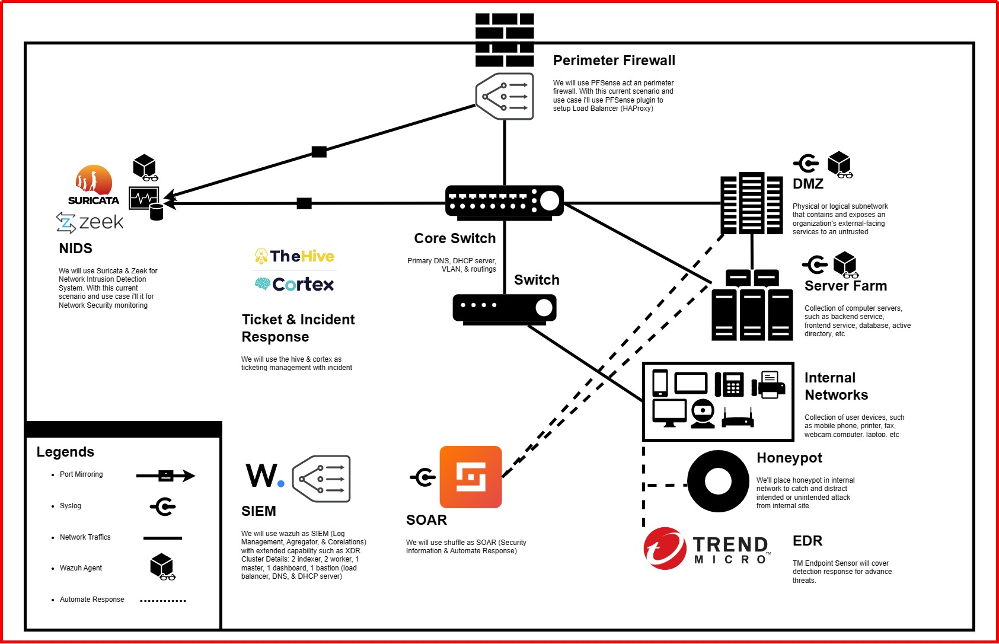

# Security-Blue-Team
This repository will describe the details surrounding the SIEM (wazuh) mini project, which will cover all aspects of topology design, deployment, rules, integration, and fine tune.

## Topology & Prototype

## Docs & Articles
[Notion](https://13ihsan92.notion.site/Documentation-san-NBA-stl-b5f06c8384c34fbb877a1313cffd7804)

## Other Refence About Rules, Architecture, & Compliance
- [Open Enterprise Security Architecture (O-ESA)](https://pubs.opengroup.org/security/o-esa/#_Toc291061776)
- [Security Architecture Patterns](https://www.opensecurityarchitecture.org/cms/library/patternlandscape)

## Author
- Name: san@NBA.stl~# (San Nabastala)
- Volunter: Kamar Kamsib, Pentesting Indonesia, Orang Siber Indonesia
- Related Security Experience: Security Analyst, Freelance Vulnerability Assessment
- Certification: RHCSA, eJPT, CAP

> Find me on our Telegram Group: [Pentesting Indonesia](https://t.me/PentestingIndonesia).

If you want to discuss more about tech stack or anything else about this repo, feel free to contact me on linkedin, and we have private whatsapp group to develop this repo. So, if you want to join us... Please feel free to direct messages.

Please keep this repository active by contributing to this repo :)
