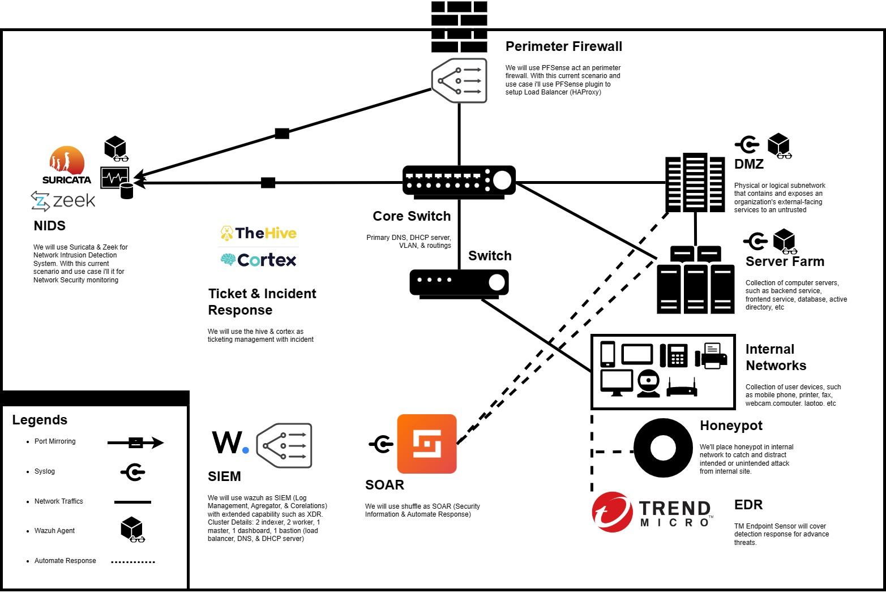

# Security-Blue-Team
This repository will describe the details surrounding the SIEM (wazuh) mini project, which will cover all aspects of topology design, deployment, rules, integration, and fine tune.

## Topology & Prototype

## Docs & Articles
[Notion](https://13ihsan92.notion.site/Documentation-san-NBA-stl-b5f06c8384c34fbb877a1313cffd7804)
